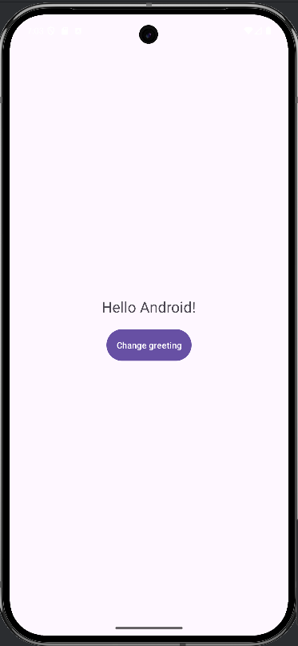
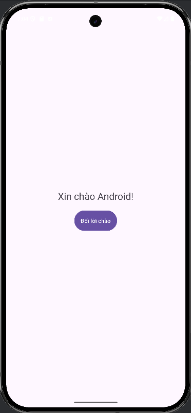

👋 Task 1 – Hello Android
📌 Overview

Ứng dụng Android đầu tiên hiển thị lời chào và cho phép người dùng chuyển đổi ngôn ngữ giữa tiếng Anh và tiếng Việt.

🚀 Tech Stack

Language: Java

IDE: Android Studio

SDK: Android 24+

📱 Main Features

Hiển thị lời chào mặc định bằng tiếng Anh.

Nút “Change Greeting” giúp chuyển giữa:

“Hello Android!”

“Xin chào Android!”

Nút thay đổi nhãn theo ngôn ngữ hiện tại.

📸 Demo

   

🛠 Run Instructions

Mở project bằng Android Studio.

Chọn Run → Run 'app'.

Ứng dụng sẽ chạy trên emulator hoặc thiết bị thật.