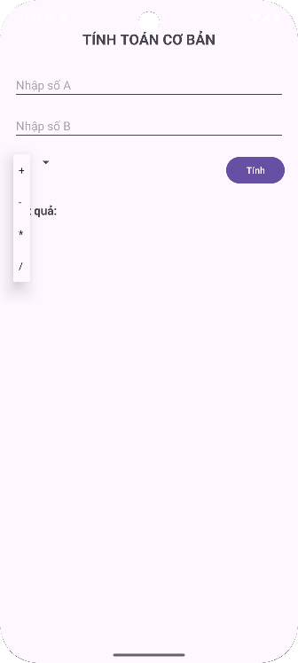

# 🧮 TH_Bai1_BasicGUI_SimpleMath

Ứng dụng Android cơ bản cho phép người dùng nhập vào **hai số A và B**, chọn một trong **bốn phép toán (+, −, ×, ÷)** và hiển thị kết quả tương ứng.  
Dự án được xây dựng bằng **Java** sử dụng **ConstraintLayout** để bố trí giao diện.

---

## 🚀 Giới thiệu

- Minh họa cách sử dụng **EditText**, **Spinner**, **Button** và **TextView** trong Android.  
- Giao diện thiết kế bằng **ConstraintLayout** — bố cục gọn gàng, dễ mở rộng.  
- Có xử lý ngoại lệ khi nhập sai dữ liệu hoặc chia cho 0.  
- Kết quả tự động **bỏ phần `.0`** nếu là số nguyên.

---

## ✨ Tính năng

✅ Nhập hai số A và B  
✅ Chọn phép toán: `+`, `−`, `×`, `÷`  
✅ Kiểm tra chia cho 0 và hiển thị cảnh báo  
✅ Tự động định dạng kết quả (bỏ `.0`, làm tròn 4 chữ số)  
✅ Giao diện thân thiện, dễ hiểu  

---

## 📱 Giao diện minh họa

| Màn hình chính | Kết quả phép tính |
|:---------------:|:-----------------:|
|  |  |