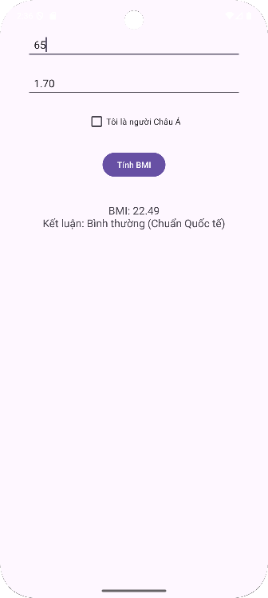
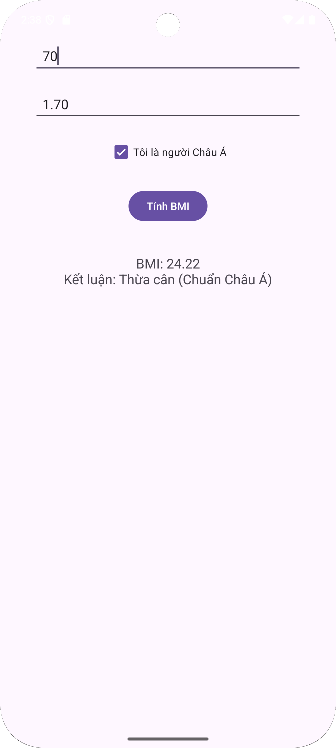

# 🧮 TH_Bai2_BasicGUI_BMI
Ứng dụng Android cơ bản dùng để **tính chỉ số BMI (Body Mass Index)**, có giao diện đồ họa đơn giản với các chức năng nhập chiều cao, cân nặng, chọn giới tính và xác định có phải người Châu Á hay không.

---

## 📱 Giới thiệu

Ứng dụng giúp người dùng:
- Nhập chiều cao (cm) và cân nặng (kg)
- Chọn **giới tính (Nam / Nữ)**
- Chọn **“Là người Châu Á”** để tính theo chuẩn phân loại BMI riêng
- Hiển thị kết quả BMI và phân loại theo tiêu chuẩn tương ứng.

---

### Phân loại theo **chuẩn WHO (không Châu Á)**
| BMI | Phân loại |
|-----|------------|
| < 18.5 | Thiếu cân |
| 18.5 – 24.9 | Bình thường |
| 25 – 29.9 | Thừa cân |
| ≥ 30 | Béo phì |

### Phân loại theo **chuẩn Châu Á**
| BMI | Phân loại |
|-----|------------|
| < 18.5 | Thiếu cân |
| 18.5 – 22.9 | Bình thường |
| 23 – 27.4 | Thừa cân |
| ≥ 27.5 | Béo phì |

---

## 📱 Giao diện minh họa

| Màn hình 1 | Màn hình 2 |
|:---------------:|:-----------------:|
|  |  |