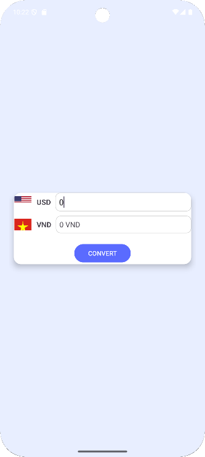

# 💱 TH Currency Converter

Ứng dụng **TH Currency Converter** được phát triển bằng **Java** và **Android Studio**, giúp người dùng dễ dàng **chuyển đổi tiền tệ giữa USD 🇺🇸 và VND 🇻🇳**.  
Giao diện thân thiện, thiết kế trực quan, phù hợp cho người mới học lập trình Android.

---

## 🚀 Tính năng
- Chuyển đổi tiền tệ **USD ↔ VND** nhanh chóng.  
- Hiển thị **2 lá cờ quốc gia** 🇺🇸 🇻🇳 để chọn loại tiền.  
- **Rounded EditText** giúp nhập liệu đẹp mắt, hiện đại.  
- **CardView** tạo hiệu ứng bo góc và bóng đổ mềm mại.  
- Tự động hiển thị kết quả ngay khi người dùng nhập số.  
- Hỗ trợ mọi thiết bị Android (API 26 trở lên).  

---

## 📱 Giao diện minh họa

| Màn hình chính | Sau khi chuyển đổi |
|:---------------:|:------------------:|
|  |  |