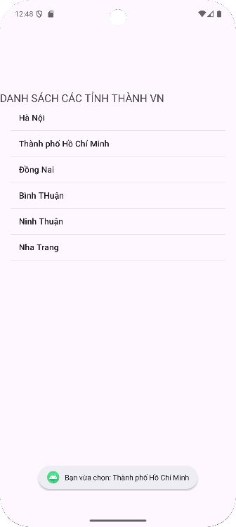

# 📱 TH_LV_DanhSachTinhThanh

Ứng dụng Android đơn giản hiển thị **danh sách các tỉnh thành Việt Nam** bằng `ListView`.

---

## 🚀 Giới thiệu
Ứng dụng được viết bằng **Java** và **Android Studio**, giúp sinh viên làm quen với:
- Cách sử dụng `ListView` để hiển thị danh sách dữ liệu.
- Tạo và gán `ArrayAdapter` cho `ListView`.
- Tương tác cơ bản giữa mã Java và giao diện XML.

---

## 📱 Giao diện minh họa

| Màn hình chính |
|:---------------:|
|  |
