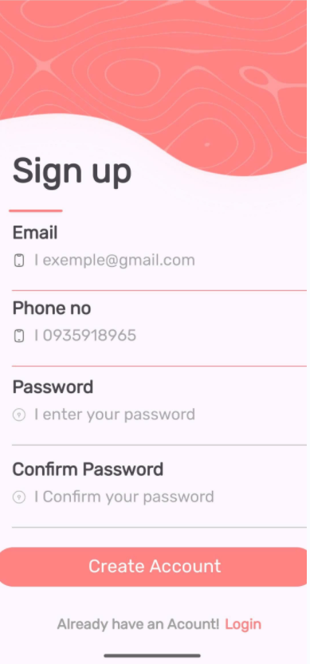

📱 TH Simple Layout UI

Ứng dụng Android viết bằng Java trong Android Studio, tái hiện màn hình Sign Up từ Figma design
.
Dự án tập trung hoàn toàn vào thiết kế giao diện, không có logic xử lý hay backend.

🚀 Giới thiệu

Màn hình Sign Up hiện đại sử dụng:

ConstraintLayout cho bố cục linh hoạt.

Material Components (TextInputEditText, Button).

Font Rubik và icon tùy chỉnh theo chuẩn Material Design.

Thích hợp làm template UI cho các ứng dụng đăng ký / đăng nhập.

🎨 Thành phần giao diện

Trường nhập: Email, Phone, Password, Confirm Password

Icon minh họa (📱 🔒 👁)

Nút Create Account nổi bật

Dòng chuyển hướng: “Already have an account? Login”

Màu sắc, font, khoảng cách chuẩn Figma

📸 Demo

⚙️ Công nghệ

Ngôn ngữ: Java

IDE: Android Studio

UI: ConstraintLayout, Material Components

Font: Rubik

📌 Ghi chú

Dự án chỉ có giao diện, chưa có xử lý hay backend.

Có thể mở rộng với Firebase Auth hoặc API tùy chỉnh.