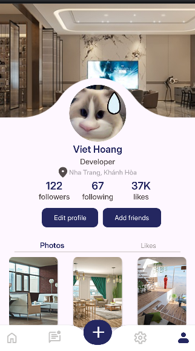

📱 TH Simple Layout UI 2

Ứng dụng Android viết bằng Java trong Android Studio, mô phỏng giao diện Profile Screen sử dụng ConstraintLayout và Material Components.
Dự án chỉ tập trung vào thiết kế giao diện, không có xử lý backend.
Thiết kế gốc: Figma – User Profile / Settings Screen

🚀 Giới thiệu

Giao diện Profile hiện đại, bao gồm:

Ảnh đại diện, tên, nghề nghiệp, địa điểm

Thống kê: Followers, Following, Likes

Nút Edit profile, Add friends

Thư viện ảnh cá nhân

Thanh bottom navigation và nút Add (+) nổi

🎨 Tính năng UI

Avatar bo tròn

Thông tin người dùng và vị trí

Các nút tương tác

Lưới ảnh (Photos)

Thanh điều hướng và nút hành động nổi

📸 Demo

⚙️ Công nghệ

Ngôn ngữ: Java

IDE: Android Studio

UI: ConstraintLayout, Material Components

Font: Inter

📌 Ghi chú

Chỉ giao diện, chưa có logic hay dữ liệu

Có thể mở rộng thêm: chỉnh sửa hồ sơ, upload ảnh, điều hướng app