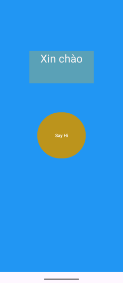

📱 Vi Du Layout 1

Ứng dụng Android cơ bản giúp làm quen với:

UI bằng ConstraintLayout

Sử dụng TextView, Button

Xử lý sự kiện nhấn nút trong Activity

🚀 Chức năng

Hiển thị nút "Say Hi"

Khi nhấn nút, hiện dòng chữ "Xin chào"

🖼️ Demo
Trước khi bấm	Sau khi bấm
	
⚙️ Công nghệ

Ngôn ngữ: Java

IDE: Android Studio

SDK: AndroidX (AppCompat, ConstraintLayout)