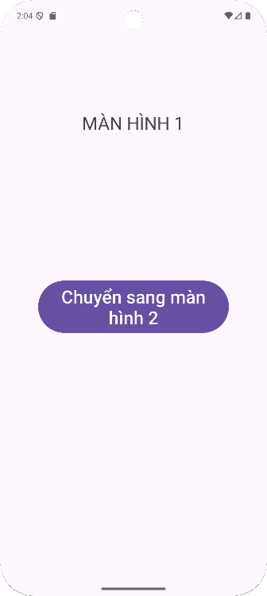

# 📱 ViDu_ChuyenMH

Ứng dụng Android minh họa cách **chuyển màn hình giữa hai Activity** bằng **Intent** trong Java.

---

## 🚀 Giới thiệu
Dự án này giúp bạn làm quen với:
- Tạo nhiều Activity trong Android.
- Sử dụng **Intent** để chuyển từ màn hình này sang màn hình khác.
- Thiết kế giao diện với **ConstraintLayout**.

---

## 📱 Giao diện minh họa

| Màn hình chính | Kết quả phép tính |
|:---------------:|:-----------------:|
|  |  |