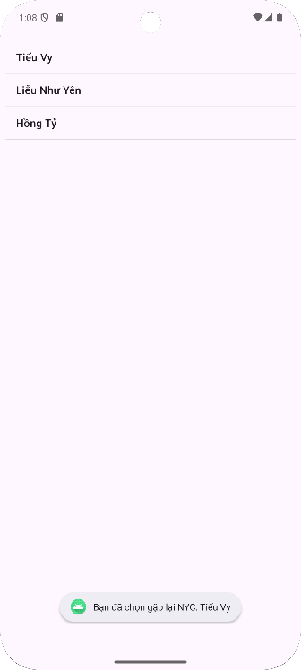

📱 ViDu_ListView

Đây là một ứng dụng Android cơ bản được viết bằng Java trong Android Studio, nhằm giúp bạn làm quen với ListView – một thành phần giao diện hiển thị danh sách dữ liệu trong Android.

🚀 Chức năng

Hiển thị danh sách tên nhân vật trong ListView.

Xử lý sự kiện khi người dùng bấm chọn một phần tử trong danh sách.

Dữ liệu được tạo sẵn (hard-code) trong hàm getData().

📱 Giao diện minh họa

| Màn hình chính |
|:---------------:|
|  |