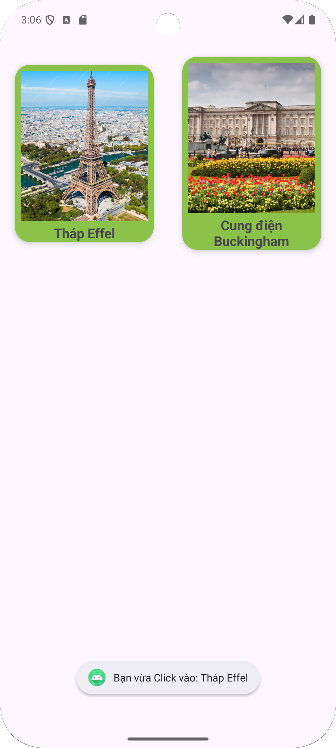

# 📱 ViDu_RecyclerView

Ứng dụng Android minh họa cách sử dụng **RecyclerView** để hiển thị danh sách các đối tượng (ví dụ: danh lam thắng cảnh).

---

## 🚀 Giới thiệu
Dự án này được viết bằng **Java** trên **Android Studio**, giúp bạn làm quen với:
- Sử dụng `RecyclerView` để hiển thị danh sách cuộn.
- Tạo **Adapter** và **ViewHolder** riêng.
- Thiết kế **layout item** cho từng phần tử trong danh sách.
- Quản lý dữ liệu dạng danh sách (List).

---

## 📱 Giao diện minh họa

| Màn hình chính |
|:---------------:|
|  |